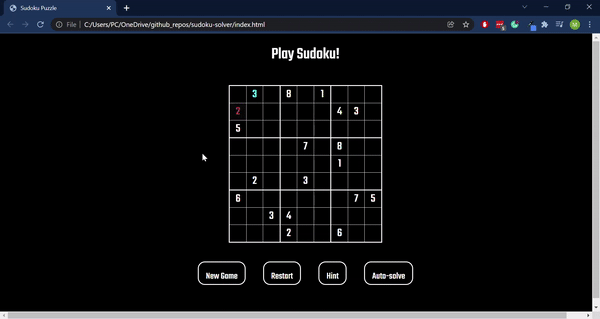

# Sudoku Solver

I was keen to practise my skills in HTML, CSS, and JS through completing an independent project. So I designed and developed a Sudoku game that runs in-browser complete with basic gameplay, a new game generator, and 'Hint' and 'AutoSolve' features. In accordance with the rules of Sudoku, the game validates the user input in each cell by checking whether the same number is present in the cell's row, column or square. The inputted number then goes blue if it is valid or red if it is invalid.

I was curious to see how I could implement the 'AutoSolve' feature using a recursive algorithm, so I learnt about backtracking algorithms and tree data structures and implemented them in the JS script.

I wanted to challenge myself to implement all the features I wanted whilst being as economical as possible with the code, which really stretched my knowledge of CSS and JS.

## Demo:

### Gameplay


### _New game_ generator
Coming soon...

### _Hint_ and _AutoSolve_ features
Coming soon...

## Tools and technologies used:
* HTML5
* CSS3
* JavaScript ES6

## Challenges:
* JavaScript's unexpected behaviour - for example, I ran into problems trying to iterate over the row and column indices when traversing the Sudoku grid, because the .getAttribute() function called on each grid cell was returning the indices as a string, despite the fact I had declared them as an integer previously in the script. I solved this problem by converting the index variables to integers using the parseInt() function:
 ```
  const squareRowIdx = (Math.floor(parseInt(columnIdx)/3.0) * 3);
 ```
* Implementing AutoSolve feature - it was particularly difficult to pass arguments to recursive function calls

## Credits:
* https://www.101computing.net/sudoku-generator-algorithm/
* https://medium.com/codex/building-a-sudoku-solver-and-generator-in-python-2-3-5eef3141702c
* https://en.wikipedia.org/wiki/Sudoku_solving_algorithms
* https://medium.com/nerd-for-tech/solve-sudoku-using-depth-first-search-algorithm-dfs-in-python-2be3caa08ccd
* https://favtutor.com/blogs/depth-first-search-python
* [ Sudoku Solver - Computerphile](https://www.youtube.com/watch?v=G_UYXzGuqvM&ab_channel=Computerphile)


## TO-DO:
* Stop buttons from moving when one is hovered over
* Increase buttons' size and buttons' font size
* Move input box text content to grid cell text content when the grid cell is deselected
* Deselect cell when there's a click event outside the grid
  * Add an event listener to body and link to function that deselects all grid cells
* Implement auto-solver and auto-generator features
